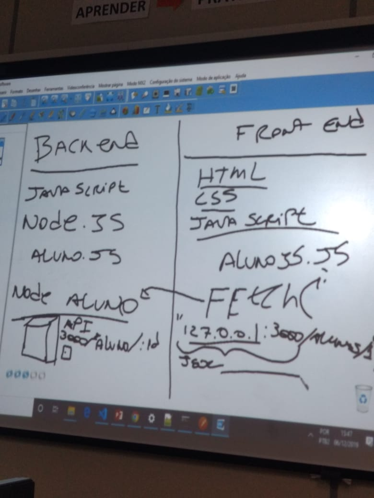

# aula-nodejs
## Exercícios  no bootcamp generation usando node e json.

Aprendendo o conceito do JS no frontend e o JS no backend. Usando e entendendo o método fetch, para consumo de serviços API 

